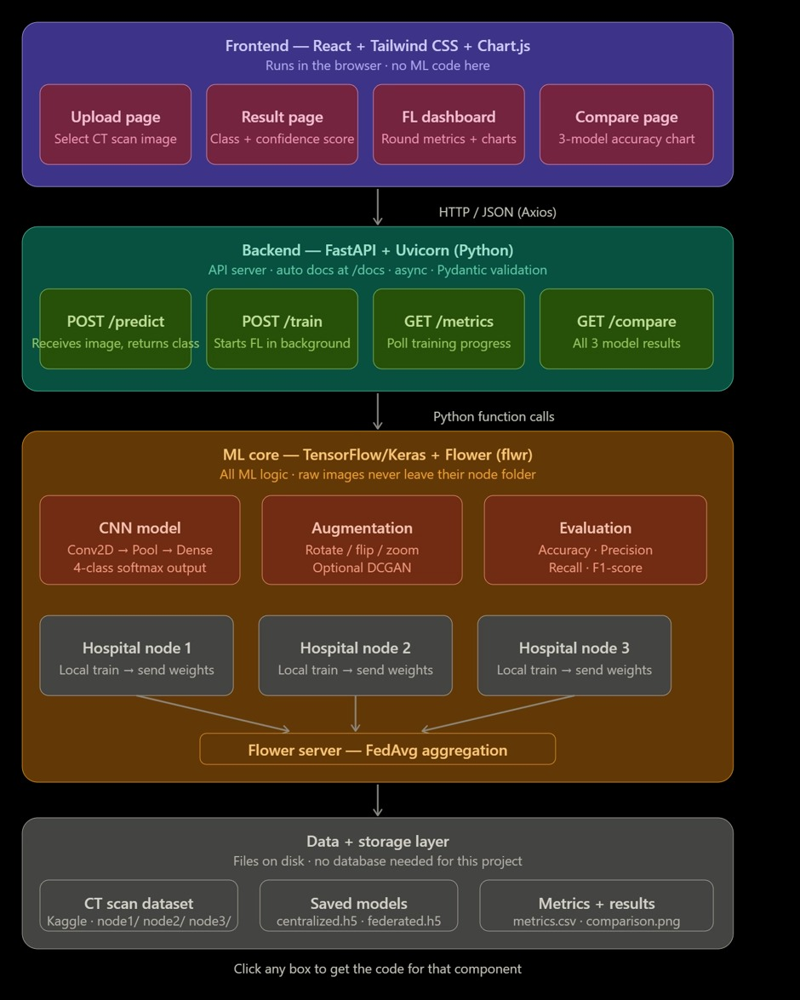

# Privacy-Preserving Cancer Detection using Federated Learning with Synthetic Data Augmentation

> **4-class Chest CT-Scan classification** — without raw patient data ever leaving individual hospital nodes.  
> Built with TensorFlow/Keras · Flower (flwr) · FastAPI · React

---

## System Architecture



---

## Project Overview

Traditional cancer detection models require centralizing patient CT-scan data on a single server — a major privacy and regulatory risk. This project uses **Federated Learning (FL)** to train a shared CNN across three simulated "hospital nodes" without any raw images leaving the node. **Synthetic data augmentation (DCGAN)** compensates for the small per-node dataset size.

### Team & Components

| Component | Owner | Tech |
|-----------|-------|------|
| **Data Pipeline + CNN** (this repo) | Chiranthan | TensorFlow, OpenCV, NumPy |
| Federated Learning client/server | Rohith | Flower (flwr) |
| Synthetic Data Augmentation | Shree Gowda | DCGAN / Keras |
| Backend API | Pavan | FastAPI, Uvicorn |
| Frontend Dashboard | — | React, Tailwind CSS, Chart.js |

---

## Chiranthan's Component — Data Pipeline + CNN

### What this component does

```
Kaggle CT-Scan dataset
        │
        ▼
explore_data.py   ──► class counts + sample_grid.png  (sanity check)
        │
        ▼
preprocess.py     ──► X_all.npy (N×224×224×3)  +  y_all.npy (N,)
        │
        ▼
partition.py      ──► data/node1/  node2/  node3/  test/   (IID split, seed=42)
        │
        ▼
train_centralized.py ──► models/centralized_model.h5
                         results/centralized_metrics.json
```

The **centralized model** is the accuracy *ceiling* — what you'd achieve if privacy weren't a concern and all hospitals merged data. The federated model (Rohith's part) should approach but not exceed this.

### CNN Architecture (`ml/model.py`)

```
Input (224×224×3)
  │
  ├── Conv2D(32, 3×3, ReLU) → MaxPool(2×2)
  ├── Conv2D(64, 3×3, ReLU) → MaxPool(2×2)
  ├── Conv2D(128, 3×3, ReLU) → MaxPool(2×2)
  │
  ├── Flatten
  ├── Dense(256, ReLU)
  ├── Dropout(0.4)
  └── Dense(4, Softmax)          ← 4 classes

Optimizer : Adam
Loss      : Sparse Categorical Crossentropy
```

### Dataset

| Class | Label | Images |
|-------|-------|--------|
| Adenocarcinoma | 0 | 338 |
| Large Cell Carcinoma | 1 | 187 |
| Squamous Cell Carcinoma | 2 | 260 |
| Normal | 3 | 215 |
| **Total** | | **1,000** |

### Results (Centralized Baseline)

| Metric | Value |
|--------|-------|
| **Test Accuracy** | **88.00%** |
| Train Accuracy (epoch 15) | 99.53% |
| Val Accuracy (epoch 15) | 86.87% |
| Training Hardware | Tesla T4 GPU (Colab) |
| Epochs | 15 |
| Batch Size | 32 |

---

## Repository Layout

```
├── ml/
│   ├── model.py               ← CNN architecture — shared with all teammates
│   ├── explore_data.py        ← EDA: class counts, sample image grid
│   ├── preprocess.py          ← raw images → X_all.npy, y_all.npy
│   ├── partition.py           ← IID split → node1/ node2/ node3/ test/
│   └── train_centralized.py  ← centralized baseline training
├── data/
│   ├── raw/                   ← place Kaggle images here (not committed)
│   ├── node1/  node2/  node3/  test/   ← generated (not committed)
│   ├── class_map.json
│   └── download.md
├── models/                    ← centralized_model.h5 (not committed — share via Drive)
├── results/                   ← centralized_metrics.json
├── docs/
│   └── architecture.png       ← full system architecture diagram
├── Chiranthan_Colab_Training.ipynb
├── setup.sh                   ← Linux/macOS/Git Bash bootstrap
├── setup.bat                  ← Windows bootstrap
├── requirements.txt
└── .gitignore
```

---

## Quick Start — Local

```bash
# 1. Bootstrap (creates venv + installs deps + creates folders)
./setup.sh          # Linux / macOS / Git Bash
setup.bat           # Windows

# 2. Activate venv
source venv/bin/activate       # Linux/macOS
venv\Scripts\activate          # Windows

# 3. Place dataset images in data/raw/<class_name>/

# 4. Run pipeline (from project root)
python ml/explore_data.py
python ml/preprocess.py
python ml/partition.py
python ml/train_centralized.py
```

## Quick Start — Google Colab (GPU)

1. Upload `Chiranthan_Colab_Training.ipynb` to [colab.research.google.com](https://colab.research.google.com)
2. **Runtime → Change runtime type → T4 GPU**
3. Place dataset in `MyDrive/Data/` (train/ valid/ test/ subfolders)
4. Upload `.py` files to `MyDrive/FL_Project/`
5. Run all cells top to bottom

---

## Handoff to Teammates

| Teammate | Files needed |
|----------|-------------|
| **Rohith** (FL) | `data/node1/`, `node2/`, `node3/` + `ml/model.py` |
| **Shree Gowda** (GAN) | `data/node1/`, `node2/`, `node3/` |
| **Pavan** (Backend) | `models/centralized_model.h5` + `data/class_map.json` |

Share via Google Drive: `MyDrive/FL_Project/` folder.

---

## Git Workflow

```bash
git checkout -b chiranthan/data-cnn
git add ml/ data/class_map.json data/download.md docs/
git add requirements.txt .gitignore README.md setup.sh setup.bat
git add Chiranthan_Colab_Training.ipynb
git commit -m "feat: data pipeline + CNN baseline (88% test accuracy)"
git push origin chiranthan/data-cnn
```

> `*.npy` and `*.h5` are excluded by `.gitignore` — share large files via Google Drive.
